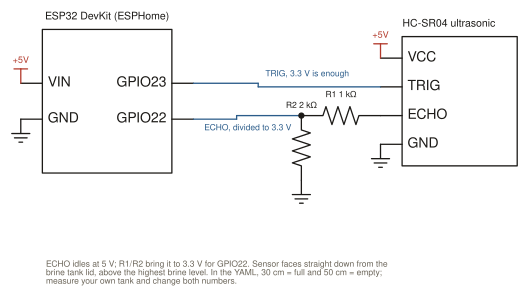

# ESPHome water softener salt monitor

An ESP32 and an HC-SR04 ultrasonic sensor in the brine tank lid. Reports the salt
level as a percentage to Home Assistant and nudges your phone before it runs out.

Writeup: [nickcupo.com/projects/water-softener-salt-monitor](https://nickcupo.com/projects/water-softener-salt-monitor)

## How it works

- The sensor pings once a minute; distance to the salt surface becomes a percentage
  between two calibration points (`full_distance` and `empty_distance` in the YAML,
  30 cm and 50 cm on my tank).
- A moving average smooths the raw distance.
- A second filter holds the reported value steady through a sudden rise, because
  brine sloshing and a hand in the tank both look like a refill for a few minutes.
  If the rise is still there after 30 minutes, it was a real refill and the new value
  is accepted.

## Hardware

| Part | Notes |
|---|---|
| ESP32 DevKit (esp32dev) | |
| HC-SR04 ultrasonic sensor | Runs on 5 V |
| 1 kΩ + 2 kΩ resistors | Divider on ECHO, which idles at 5 V; ESP32 pins are 3.3 V |
| 5 V supply | 1 A USB |

Pins: `GPIO23` trigger, `GPIO22` echo. Mount the sensor facing straight down, above
the highest brine level, and keep the lid from shifting; a few millimetres changes the
calibration.

## Install

1. Copy `secrets.yaml.example` to `secrets.yaml` and fill it in.
2. Measure the distance from the sensor to the salt when the tank is topped off and
   when it needs refilling. Put those in `full_distance` and `empty_distance`.
3. `esphome run salt-level-monitor.yaml`.

## Home Assistant

`homeassistant/automations.yaml` is the low-salt alert (below 30% for 5 minutes).
`homeassistant/template-sensor.yaml` rounds the level to the nearest 5% for the
dashboard.

## License

MIT.
